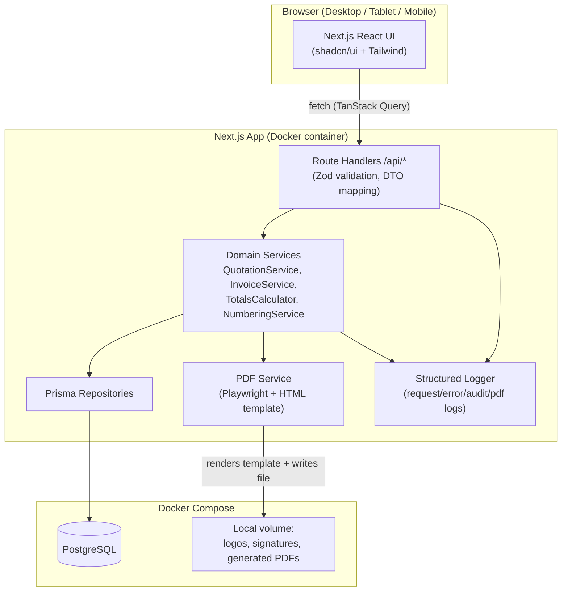
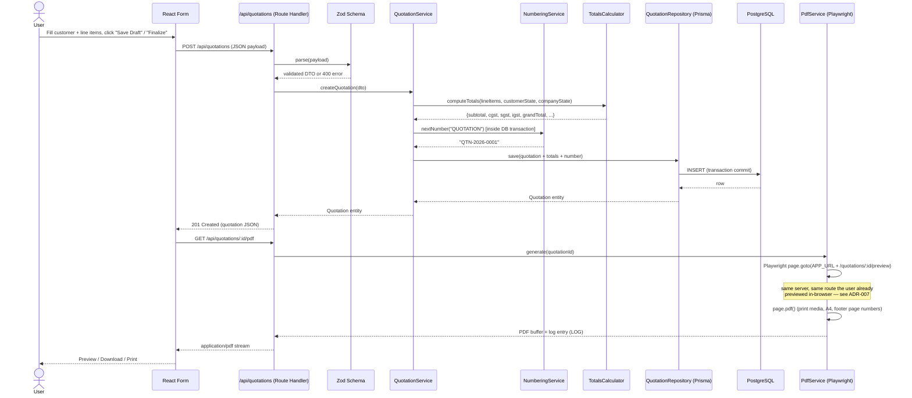

# Architecture

## 1. Style
Clean Architecture within a Next.js monolith (App Router), feature-based folder structure. Business logic lives in framework-agnostic **service** classes/functions that depend only on **repository interfaces**; Next.js Route Handlers and React components are thin adapters. This keeps the domain layer portable (e.g., extractable into a standalone Express/worker process later, see [future-roadmap.md](future-roadmap.md)) without a rewrite.

Layers (dependency direction: outer → inner, inner never imports outer):
```
Presentation (React components, pages)
   -> Application (route handlers / server actions, DTO mapping, Zod validation)
      -> Domain (services: QuotationService, InvoiceService, TotalsCalculator, NumberingService)
         -> Data (Prisma repositories implementing domain-defined interfaces)
            -> PostgreSQL
```

## 2. Tech Stack & Rationale
| Layer | Choice | Why |
|---|---|---|
| Frontend framework | Next.js 14 (App Router) + TypeScript | SSR for fast first paint of data-heavy list views, file-based routing, colocated API routes remove need for a separate backend service for MVP. |
| Styling | Tailwind CSS + shadcn/ui | Utility-first speed, accessible unstyled primitives (Radix) under shadcn, consistent dark/light theming via CSS variables. |
| Forms | React Hook Form + Zod | Uncontrolled-first performance for large line-item tables; Zod schema shared between client validation and server validation (single source of truth). |
| Data fetching/cache | TanStack Query | Cache invalidation on mutation, background refetch, optimistic updates for draft saves. |
| Backend | Next.js Route Handlers | No separate Express service justified for a single-user local MVP; same deployable unit simplifies Docker/CI. Revisit only if a background job queue (future) needs a long-running process. |
| ORM/DB | Prisma + PostgreSQL | Type-safe queries, migrations, and PostgreSQL's transactional guarantees are required for numbering correctness (ADR-006) and financial data integrity. |
| PDF generation | HTML/CSS template rendered via headless Chromium (Playwright) → PDF | "Pixel-perfect from HTML" requirement is best met by rendering real HTML/CSS with a browser engine rather than a PDF-primitive library (e.g., pdfkit), which would require re-implementing layout by hand. |
| Auth (future-ready, not in MVP) | Better Auth | Self-hosted, no vendor lock-in, fits local-first deployment story better than a SaaS auth provider for this client. |

## 3. System Architecture Diagram


## 4. Data Flow Diagram — "Create Quotation → PDF"


## 5. User Flow — Quotation to Invoice

```mermaid
flowchart LR
    A[Dashboard] --> B[New Quotation]
    B --> C{Customer exists?}
    C -- No --> D[Create Customer inline]
    C -- Yes --> E[Select Customer]
    D --> E
    E --> F[Add Line Items\nfrom catalog or ad-hoc]
    F --> G[Review computed totals\nGST breakdown]
    G --> H{Save as Draft\nor Finalize?}
    H -- Draft --> I[Draft saved, no number yet\nediting unrestricted]
    H -- Finalize --> J[Number allocated\nStatus: SENT]
    J --> K[Preview PDF]
    K --> L[Download / Print]
    J --> M{Customer approves?}
    M -- Yes --> N[Mark Approved]
    N --> O[Convert to Invoice]
    O --> P[New Draft Invoice\nline items copied]
    P --> Q[Finalize Invoice\nnumber allocated]
    Q --> R[Preview / Download / Print PDF]
    R --> S{Payment received?}
    S -- Yes --> T[Mark Paid + paid date]
    S -- No --> U[Status: Pending]
    M -- No --> V[Cancel or Edit -> new version]
```


## 6. Folder Structure (high level)
```
src/
  app/                     # Next.js App Router pages + route handlers
    (dashboard)/
    api/
  features/                # feature-based modules
    customers/
      components/  hooks/  services/  validators/  types/
    items/
    quotations/
    invoices/
    settings/
    pdf/
  components/               # shared/reusable UI components (shadcn wrappers)
  repositories/             # Prisma-backed repository implementations
  database/                 # Prisma schema, migrations, seed
  services/                 # cross-feature domain services (TotalsCalculator, NumberingService)
  hooks/                     # shared React hooks
  utils/                     # pure utility functions
  validators/                 # shared Zod schemas (money, GSTIN, etc.)
  types/                       # shared TypeScript types
  constants/
  templates/                   # PDF HTML/CSS templates
  tests/
```
Full rationale for frontend structure: [frontend-architecture.md](frontend-architecture.md). Backend/service layering detail: [backend-architecture.md](backend-architecture.md). Database detail: [database-design.md](database-design.md). API contracts: [api-spec.md](api-spec.md).
