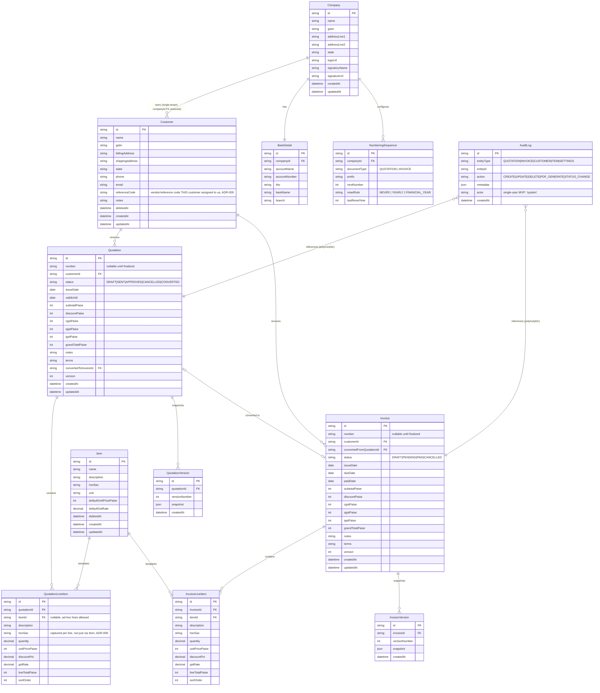

# Database Design

PostgreSQL via Prisma ORM. All monetary columns are `Int` (paise) per FR-5.5. All primary keys are `cuid()`. All tables have `createdAt`/`updatedAt`; mutable business entities have `deletedAt` (soft delete).

## Entity-Relationship Diagram

## Key Design Decisions
- **Money as integer paise** (FR-5.5): eliminates float rounding; `grandTotalPaise / 100` only at display time, using banker's-rounding-free integer math throughout the calculation pipeline.
- **`number` is nullable on Quotation/Invoice**: a `DRAFT` has no number yet; numbers are only allocated on finalize (transition out of `DRAFT`), inside the transaction that also flips status (ADR-006), via `NumberingSequence` row locked with `SELECT ... FOR UPDATE`.
- **Version snapshots as JSON**: `QuotationVersion`/`InvoiceVersion` store a full JSON snapshot of the document + line items at each finalized edit (FR-3.7), rather than a normalized history table, because the snapshot is read-only/append-only and never queried relationally — JSON keeps it simple and avoids schema churn as the document shape evolves.
- **Soft delete on Customer/Item only**: Quotations/Invoices are never deleted (financial records); Customers/Items can be archived (`deletedAt`) but not hard-deleted if referenced (enforced at the service layer, not a DB constraint, so the error message can be user-friendly).
- **`companyId` reserved but Company is a singleton in MVP**: schema includes `Company`/`BankDetail`/`NumberingSequence` scoped to a company row from day one so multi-company (future-roadmap) only requires adding a `companyId` FK to Customer/Item/Quotation/Invoice, not a schema redesign.
- **Indexes**: `Customer(name)`, `Customer(gstin)`, `Item(name)`, `Quotation(status, issueDate)`, `Quotation(customerId)`, `Invoice(status, issueDate)`, `Invoice(customerId)`, `Quotation(number)` unique, `Invoice(number)` unique — supports FR-8 search/filter/sort without full scans.
- **`AuditLog` is polymorphic by `entityType`+`entityId`** (no FK constraint) since it spans multiple entity tables and must survive even if the referenced row's lifecycle differs; queried by `(entityType, entityId)` composite index.

Prisma schema implementing this design lives at `prisma/schema.prisma` (Phase 7).
